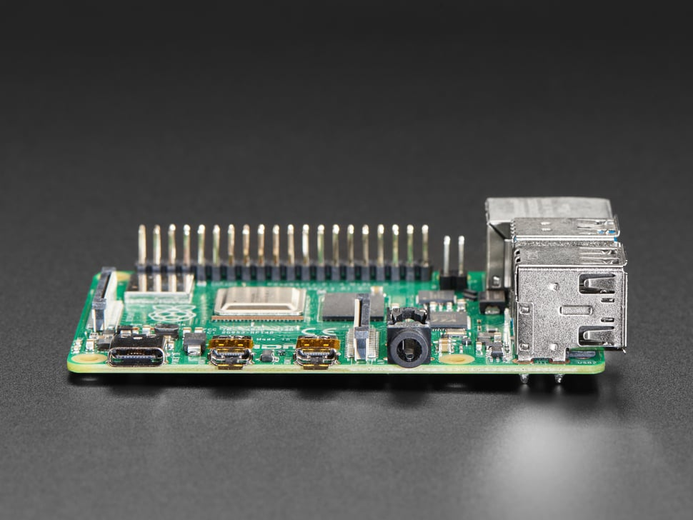
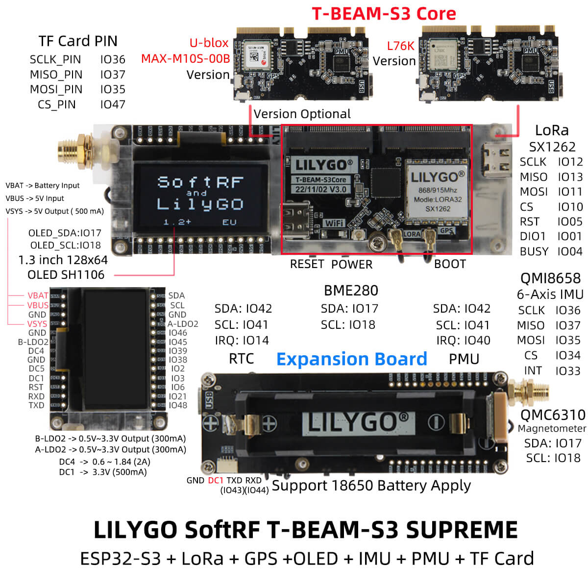
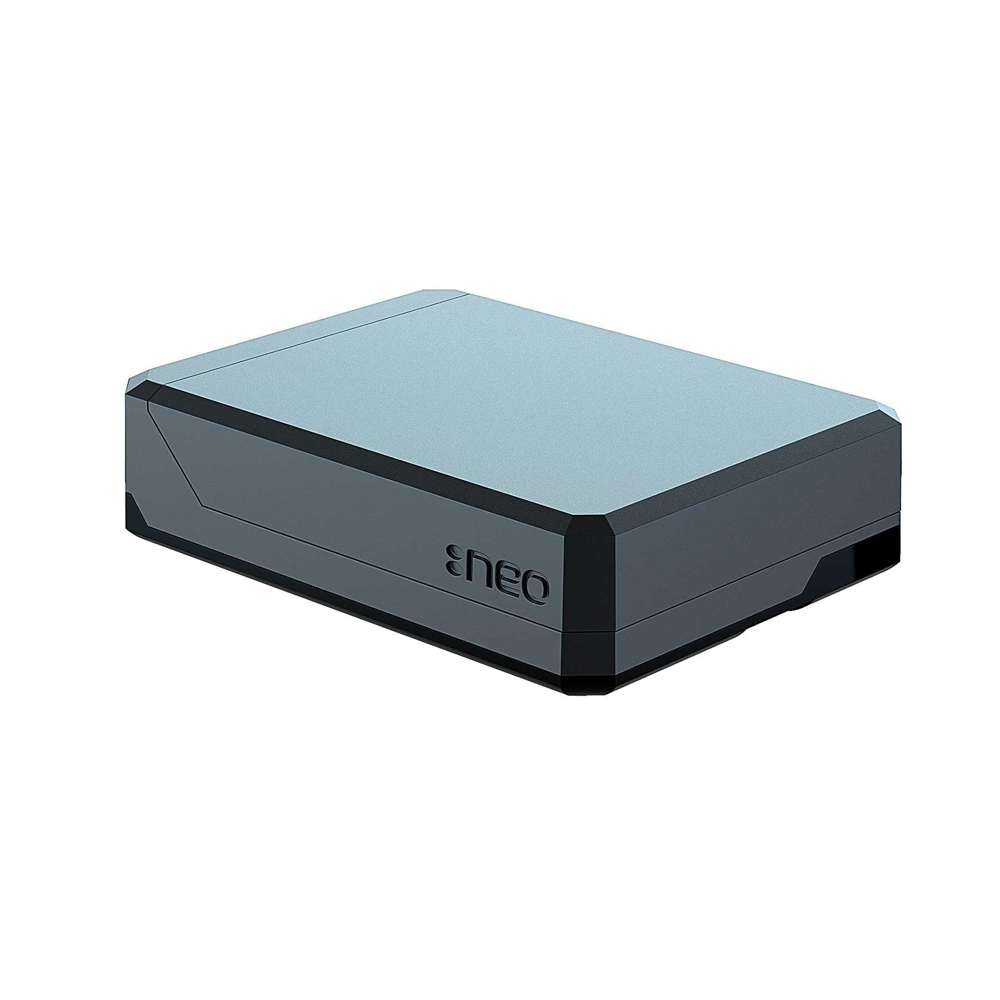
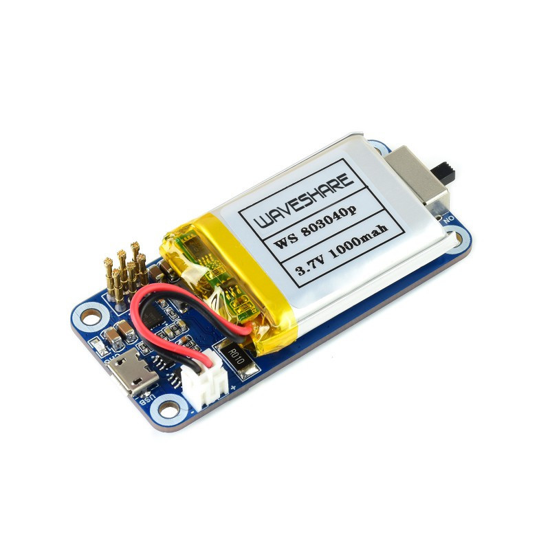
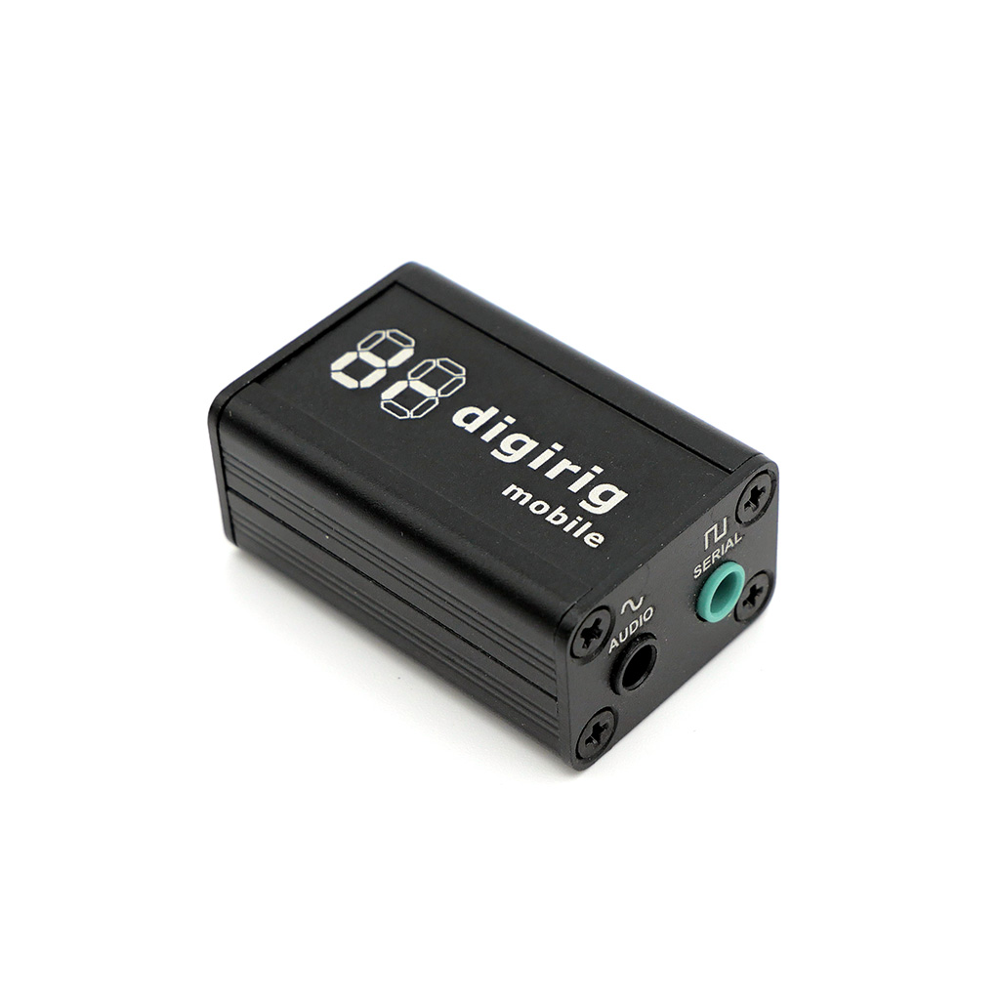

# RTAK OmniNode

A self-contained tactical communications node that bridges ATAK/CoT situational awareness over a private [Reticulum](https://reticulum.network) network. Operates without internet infrastructure using LoRa (915 MHz + 433 MHz), WiFi, Bluetooth, and AX.25 packet radio simultaneously.

---

## Hardware Overview

| | | |
|:---:|:---:|:---:|
|  |  |  |
| Raspberry Pi 4B | T-Beam Supreme (915 MHz) | T-Beam v1.1 (433 MHz) |
|  |  |  |
| Argon NEO Case | Waveshare UPS HAT D | Digirig Mobile |

---

## Bill of Materials — Per Node

### Compute

| Part | Source | Price |
|---|---|---|
| Raspberry Pi 4B — 4GB RAM | [Adafruit #4292](https://www.adafruit.com/product/4292) · [PiShop.us](https://www.pishop.us/product/raspberry-pi-4-model-b-4gb/) | $55.00 |
| Argon NEO Pi 4 Case (passive cooling) | [Argon40 direct](https://www.argon40.com/products/argon-neo-raspberry-pi-4-case) · Amazon "Argon NEO" | ~$15 |
| SanDisk 32GB Extreme A2 microSD | [Amazon B06XYHN68L](https://www.amazon.com/dp/B06XYHN68L) | ~$11 |

### LoRa RNodes — order direct from LILYGO

| Part | Source | Price |
|---|---|---|
| LilyGO T-Beam Supreme — 915 MHz (ESP32-S3 + SX1262 + GPS) | [lilygo.cc/products/t-beam-supreme](https://lilygo.cc/products/t-beam-supreme) | $37.12 |
| LilyGO T-Beam v1.1 — **select 433 MHz** at checkout (SX1278) | [lilygo.cc/products/t-beam](https://lilygo.cc/products/t-beam) | $30.77 |
| 915 MHz antenna, 3 dBi, SMA-male (fiberglass whip) | Amazon — search "915MHz LoRa antenna 3dBi SMA" | ~$11 |
| 433 MHz antenna, 3 dBi, SMA-male (fiberglass whip) | Amazon — search "433MHz LoRa antenna 3dBi SMA" | ~$11 |

> Order both T-Beams together from LILYGO — they ship in one package. Allow 2–3 weeks from China; Amazon resellers stock both at ~30% markup if faster shipping is needed.

### Power

| Part | Source | Price |
|---|---|---|
| Waveshare UPS HAT (D) for Pi 4B — 2× 21700 cells | [waveshare.com](https://www.waveshare.com/21700-ups-hat-d.htm) · [thepihut.com](https://thepihut.com/products/21700-ups-hat-d-for-raspberry-pi-4-3) | ~$25 |
| Samsung 48G or Keeppower P2150U 21700 cells ×2 | Amazon — search "21700 5000mAh" | ~$18/pair |
| Anker or Sabrent 4-port powered USB 3.0 hub | Amazon | ~$20 |

### AX.25 Packet Radio (optional, adds VHF/UHF link layer)

| Part | Source | Price |
|---|---|---|
| Digirig Mobile (USB audio + PTT interface) | [digirig.net](https://digirig.net/product/digirig-mobile/) | $54.95 |
| Kenwood cable kit for Baofeng/Kenwood radios | [digirig.net/cables](https://digirig.net/cables/) | ~$12 |
| Baofeng DM-32UV or any VHF/UHF FM handheld | Amazon / BaoFeng Tech | ~$40–60 |

### Per-Node Cost Summary

| Configuration | Est. Total |
|---|---|
| Compute + dual LoRa + antennas + power | ~$223 |
| + Digirig + radio (full AX.25 capability) | ~$330 |

---

## Assembly Instructions

### 1. Flash the microSD

1. Download [Raspberry Pi OS Lite 64-bit (Bookworm)](https://www.raspberrypi.com/software/operating-systems/) — the headless image.
2. Flash to microSD using Raspberry Pi Imager or `dd`.
3. Before ejecting: enable SSH (`touch /boot/ssh`) and optionally pre-configure WiFi (`/boot/wpa_supplicant.conf`).
4. Insert microSD into Pi.

---

### 2. Assemble the Pi

| | |
|:---:|:---:|
|  |  |
| Argon NEO — slides over Pi, SoC contacts aluminum shell | Waveshare UPS HAT D — stacks on GPIO header, holds 2× 21700 cells |

1. Seat the Pi into the Argon NEO case. The case acts as a heatsink — no thermal paste needed; press the SoC firmly against the case interior.
2. Stack the Waveshare UPS HAT (D) on the Pi's GPIO header.
3. Insert two fully-charged 21700 cells into the UPS HAT battery holder, observing polarity.
4. Connect the powered USB hub to one of the Pi's USB 3.0 ports (blue ports).

---

### 3. Flash RNode firmware onto both T-Beams

| | |
|:---:|:---:|
|  |  |
| T-Beam Supreme (915 MHz, SX1262) | T-Beam v1.1 (433 MHz, SX1278) |

Do this from any Linux/Mac/Windows machine with Python installed before connecting the T-Beams to the Pi.

```bash
pip install rnodeconf

# Flash 915 MHz T-Beam Supreme
rnodeconf --autoinstall /dev/ttyUSB0   # or COMx on Windows

# Flash 433 MHz T-Beam v1.1
rnodeconf --autoinstall /dev/ttyUSB1
```

When prompted, select the correct board variant (T-Beam / T-Beam Supreme). The firmware flash takes ~2 minutes per board. After flashing, attach the correct antenna to each board — **never power a LoRa radio without an antenna attached**.

---

### 4. Connect radios to the Pi

1. Connect the 915 MHz T-Beam Supreme to the USB hub via USB-C.
2. Connect the 433 MHz T-Beam v1.1 to the USB hub via USB or Micro-USB.
3. *(If using AX.25):* Connect Digirig Mobile to the USB hub. Connect the Kenwood cable from Digirig to the radio's speaker/mic port.

   

4. Verify port assignments on the Pi: `ls /dev/ttyUSB*` — note which port is which board (unplug one at a time to confirm).

---

### 5. Deploy the RTAK software

SSH into the Pi, then:

```bash
sudo apt-get update && sudo apt-get install -y git
git clone https://github.com/private-nemo/RTAK.git
cd RTAK
sudo bash setup_pi.sh
```

The setup script will:
- Install Python dependencies (`rns`, `lxmf`, `pytak`, `FreeTAKServer`)
- Flash Reticulum config to `/etc/reticulum/config` (dual RNode + WiFi auto-discovery)
- Generate a private CA and server TLS certificate for FreeTAKServer
- Harden the firewall (UFW): blocks plain-text CoT port 8087, opens SSL port 8089
- Install and enable `freetakserver` and `rtak-bridge` as systemd services

> If your T-Beam port assignments differ from `/dev/ttyUSB0` and `/dev/ttyUSB1`, edit `/etc/reticulum/config` before starting services.

---

### 6. Start services and note your node hash

```bash
sudo systemctl start freetakserver rtak-bridge
sudo journalctl -u rtak-bridge -f
```

The bridge will print a line like:
```
RTAK bridge address: <a1b2c3d4e5f6a7b8c9d0e1f2a3b4c5d6>
Share this hash with other node operators so they can add it to rtak_peers.txt
```

Copy this 32-character hex hash. Share it securely with operators of other RTAK OmniNodes. They add it to their `/opt/rtak/rtak_peers.txt`; you add theirs to yours.

---

### 7. Add trusted peer nodes

Edit `/opt/rtak/rtak_peers.txt` on each node. One hash per line:

```
# Example
a1b2c3d4e5f6a7b8c9d0e1f2a3b4c5d6
b2c3d4e5f6a7b8c9d0e1f2a3b4c5d6e7
```

Only nodes listed here can relay CoT to your node. Inbound messages from unknown sources are silently dropped.

---

### 8. Generate operator client certificates

Each ATAK device needs a client certificate signed by this node's private CA:

```bash
sudo bash /opt/rtak/generate_user_cert.sh CALLSIGN
```

This creates `/opt/rtak/certs/CALLSIGN.p12`. Transfer this file to the operator's Android device over a trusted channel (USB, local network, Signal, etc.).

**Import into ATAK:**
1. Copy `.p12` to the Android device.
2. ATAK → Settings → Network → Manage Server Connections → Add server.
3. Enter the Pi's IP address, port `8089`, enable SSL.
4. Import the `.p12` as the client certificate. Password: `rtak_user`.

---

### 9. Verify the network

From an ATAK client connected to the node, drop a marker. Confirm it appears on ATAK clients connected to a remote RTAK OmniNode within Reticulum range. LoRa range is typically 5–15 km line-of-sight depending on terrain and antenna height.

---

## Security Model

| Layer | Protection |
|---|---|
| LoRa / WiFi / AX.25 transport | Reticulum end-to-end encryption (Curve25519 + AES) |
| ATAK client → FTS | TLS mutual authentication — client certificate required |
| Node-to-node relay | Whitelist-only — `rtak_peers.txt` checked on every inbound message |
| Host firewall | UFW — only SSH (22), SSL CoT (8089), data packages (8080) open |

---

## Minimum Network

Two OmniNodes form a functional network. One node runs FreeTAKServer as the primary server; the second can run as a full node or as a relay-only (no FTS). Reticulum handles multi-hop routing automatically — intermediate nodes relay traffic without needing to be trusted RTAK peers.

---

## Repository

<https://github.com/private-nemo/RTAK>
